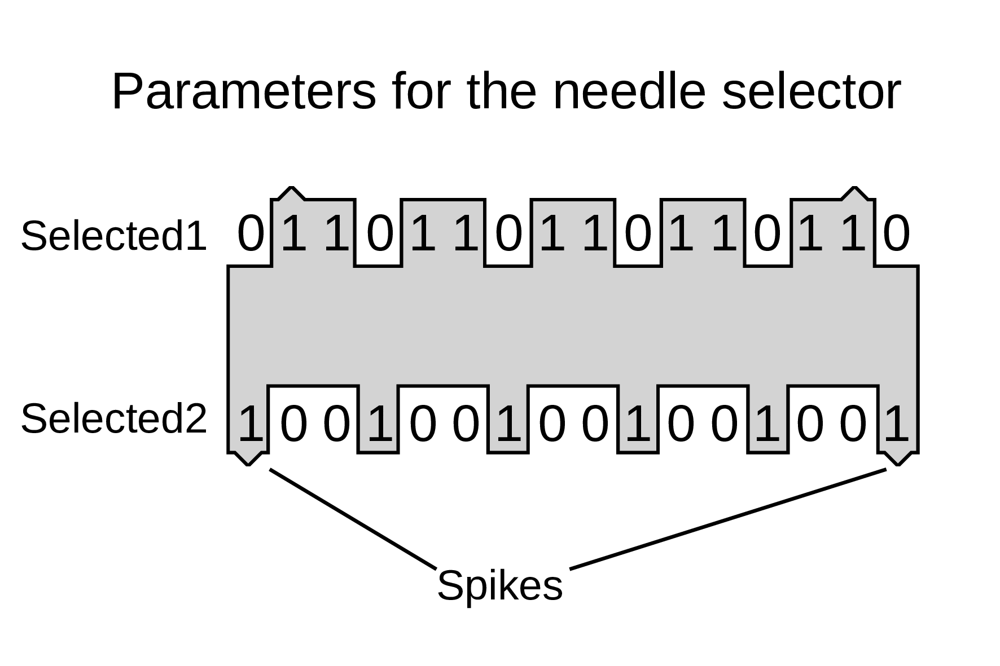

# Needle selector for the LK150 knitting machine

A few additional 3D printable needle selectors for the LK150 knitting machine.

There is customizable OpenSCAD file for the object.  
The pattern of the needle selector can be changed, it is stored in an array of ones and zeroes.  
There are two arrays for each side.  
There are also arrays for that triangle shaped object that guides the needle selector. I call those spikes.

The _generate\_stls.py_ generates the 3D object files for the patterns contained in that file.

If you spot an error or want a needle selector with different parameters, feel free to open an issue.

This project is available on [Thingiverse](https://www.thingiverse.com/thing:6894168) as well.
